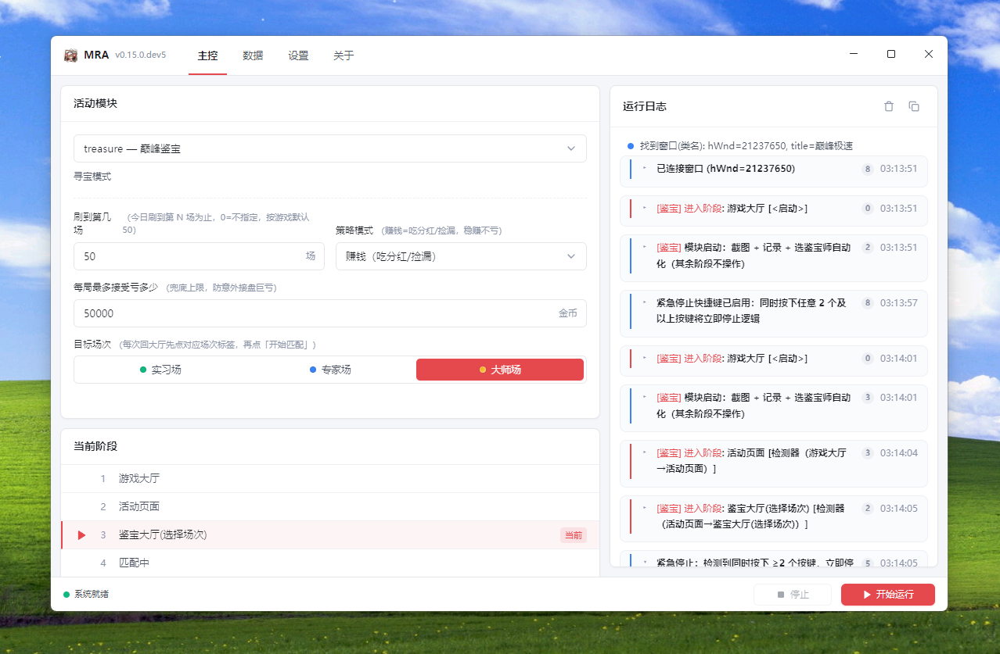
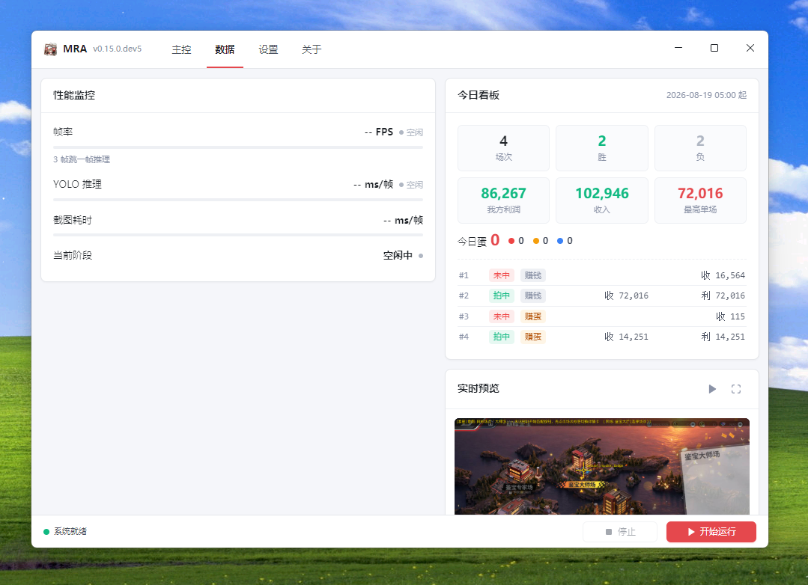
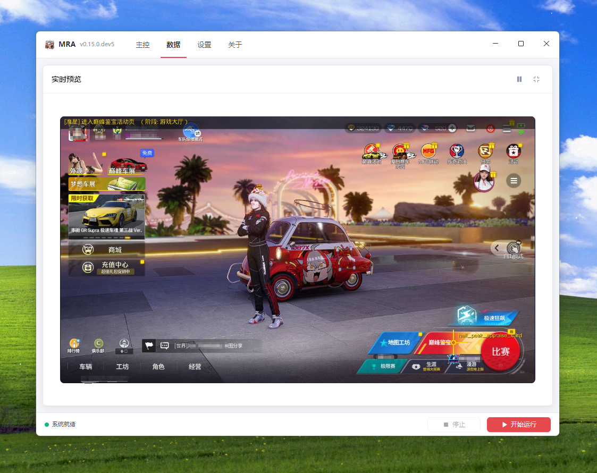

<p align="center">
  
</p>

<h1 align="center">MaaRacingAssistant</h1>

<p align="center">
  <em>模块化游戏自动化平台 —— MAA Framework × YOLOv8 × vgamepad</em>
</p>

<p align="center">
  
  
  
  
  
  
  <a href="https://afdian.com/a/MaaRacingAssistant">
    
  </a>
  <!-- 正式 v1.0.0 发版时换用 release badge：
   -->
</p>

---

> [!NOTE]
> **维护说明（个人项目）**
>
> 本仓库为**个人开发者在业余时间维护的开源项目**，**不提供长期维护承诺**，也不对未来兼容性、稳定性或功能演进做任何保证。
> - **打 tag 即出正式 Release 包**；未打 tag 的改动仅提交到 master，可能尚未打包或有中途变化。
> - 遇到问题请优先提交 [Issue](https://github.com/d542Bb/MaaRacingAssistant/issues)；修复取决于个人时间与精力，**不保证响应与修复时限（无 SLA）**。
> - 源码完全开源，**欢迎任何人 fork / 提 PR / 参与维护**——项目的延续依靠社区而非单一开发者。

> [!WARNING]
> ⚠️ **免责与合规声明**
>
> 本项目为**游戏自动化技术研究与学习项目**，基于图像识别与虚拟手柄模拟，**仅供个人学习、技术交流与教学演示**，请勿用于任何商业或营利性目的。
>
> 本项目**仅进行画面识别与模拟输入操作**，**不读取、不篡改任何游戏数据**，**不注入进程、不修改游戏文件、不抓取通信数据包**。
>
> **严禁**将本项目或其源码用于：
> - **代练 / 代打** 等商业代练服务；
> - 制作、发布、传播或使用**外挂、作弊软件、宏脚本**等违规工具；
> - 任何**有意影响服务器排名、刷榜或破坏游戏平衡**的行为。
>
> 使用本工具操作游戏账号存在违反游戏用户协议的风险，可能导致账号处罚、封禁等后果，**所有后果由使用者自行承担，与项目及开发者无关**。
>
> 请严格遵守游戏规则与相关法律法规；若未获得游戏官方授权，请勿将本项目用于对应游戏。

> [!IMPORTANT]
> 🚧 **开发状态**
>
> **巅峰鉴宝** 为 v1.0.0 主打模块，全链路自动化已闭环并通过 CI 单测回归，稳定性打磨中；**极速狂飙** 处于开发中，可能存在不稳定表现，不纳入 v1.0.0 正式版范围。
> 如遇异常，请提交 Issue 或参考开发文档自诊。

---

## 目录

- [简介](#简介)
- [演示](#演示)
- [支持本项目](#支持本项目)
- [已实现模块](#已实现模块)
- [核心能力](#核心能力)
- [环境要求](#环境要求)
- [快速开始](#快速开始)
- [使用说明](#使用说明)
- [模块化架构](#模块化架构)
- [项目结构](#项目结构)
- [技术栈](#技术栈)
- [开发指南](#开发指南)
- [许可证](#许可证)

---

## 简介

**MaaRacingAssistant** 是一个**模块化游戏自动化平台**：以「把游戏中重复的劳作自动化」为目标，通过统一的模块框架承载各种活动。

当前主打 **巅峰鉴宝**（限时活动全链路自动化，v1.0.0 正式版范围），**极速狂飙** 处于开发中（不纳入 v1.0.0）；未来将逐步扩展更多重复性活动。

平台采用**能力接口（capability）** 隔离模块与宿主，并统一治理**资源所有权**（虚拟手柄、渲染器），保证模块可独立开发、安全组合、退出不泄漏。

---

## 演示

> **眼见为实**：下面这段视频展示电脑自己完成一场巅峰鉴宝——数据页 PEEP 实时预览 + 自动出价 + 结算看板。

<p align="center">
  <video src="https://github.com/user-attachments/assets/9bf47361-2773-447c-9900-bdf70d4b2af0" width="640" controls muted></video>
  <br>
  <em>无人值守自动鉴宝：实时预览 → 智能出价 → 结算分红</em>
</p>

### 界面截图

| GUI 主控 | 今日看板 | PEEP 实时预览 |
|---|---|---|
|  |  |  |

---

## 支持本项目

如果本项目对你有帮助，欢迎[在爱发电上赞助](https://afdian.com/a/MaaRacingAssistant)，
支持持续的开发与维护。您的每一份支持都对本项目的成长意义重大。

---

## 快速开始

分两类入口，按你的目的二选一即可：

- **只想直接使用**（不写代码）→ 跳到下方「下载即用包」一节
- **要改代码 / 参与开发** → 继续往下，走「从源码构建」四步

> 当前处于**开发阶段**：GitHub [Releases](https://github.com/d542Bb/MaaRacingAssistant/releases) 上已提供 pre-release 打包，正式 v1.0.0 尚未发布。

### 下载即用包（普通用户，无需编译）

已打包好解压即用的 Windows 包，无需安装 Python、无需编译，开箱即用。

1. 到 GitHub [Releases](https://github.com/d542Bb/MaaRacingAssistant/releases) 下载最新 **`MaaRacingAssistant-<版本>-win-x64.zip`**。
2. 用资源管理器把它**解压到任意本地目录**，会自动得到一个 `MaaRacingAssistant-<版本>-win-x64` 文件夹。
3. 打开该文件夹，**双击 `mra_shell.exe`** 启动（已自带 Python 运行时与全部依赖，exe manifest 会自动弹出 UAC 提权）。
4. 若使用**极速狂飙**模块，需先安装 [ViGEmBus 虚拟手柄驱动](https://github.com/nefarius/ViGEmBus/releases)；其余模块不需要。

> 成功标志：GUI 窗口出现，左上角版本号显示当前 `v*`，且「巅峰鉴宝」模块与 12 阶段列表正常加载（后端已连接）。

---

以下是**从源码构建**方式（面向开发者 / 贡献者）。

从零到跑通，按下面四步走；每步都有明确的「成功标志」与「失败自查」入口。完整清单见 [docs/SELF_CHECK.md](docs/SELF_CHECK.md)。

### 0. 准备

- 确认系统满足[环境要求](#环境要求)（Windows 10/11 64-bit、**管理员权限**、游戏窗口 **1280×720**）。
- 若使用**极速狂飙**模块，需先断开物理手柄（模块要求虚拟手柄独占）。

### 1. 拉取代码

```bash
git clone https://github.com/d542Bb/MaaRacingAssistant.git
cd MaaRacingAssistant
```

> 成功标志：目录下有 `README.md`、`maaracing_assistant/`、`apps/mra_shell/`。

### 2. 安装 Python 环境

```bash
python -m venv .venv
.venv\Scripts\activate
python -m pip install --upgrade pip
pip install -r requirements.txt
```

> 成功标志：`.venv\Scripts\python.exe` 存在，且 `pip show maafw` 能查到版本。
>
> 前台 `mra_shell.exe` 会从自身基目录向上定位仓库根（`pyproject.toml`）并拼接 `.venv`，**不再硬编码本机路径**，仓库可 clone 到任意磁盘位置运行。

### 3. 可行性自检（推荐）

```bash
# 依赖就位验证（导入冒烟 + 模型存在 + 单元测试）
.venv\Scripts\python.exe -m pytest tests -q
```

> 成功标志：`0 failed`。失败时逐条对照 [docs/SELF_CHECK.md](docs/SELF_CHECK.md) 的「常见失败与处理」。

### 4. 编译 GUI 并启动

```bash
# 首次使用需先编译前台 shell（管理员提权由 exe 自身 manifest 承担，无需再手动以管理员运行）
dotnet build apps\mra_shell\mra_shell.csproj -c Debug
```

编译成功后，运行编译产物 **`apps\mra_shell\bin\x64\Debug\net8.0-windows10.0.19041.0\win-x64\mra_shell.exe`** 启动 GUI（exe manifest `requireAdministrator` 会自动弹出 UAC 提权）。

> 成功标志：GUI 窗口出现，左上角版本号显示当前 `v*`，且「巅峰鉴宝」模块与 12 阶段列表正常加载（后端已连接）。

**独立调试 sidecar**（不经 GUI，等待 stdin JSONL RPC）：`python -u -m maaracing_assistant.core.sidecar`。

---

## 已实现模块

### 🏺 巅峰鉴宝（主打）

> 鉴宝活动全链路自动化：进入活动 → 选择场次 → 选择鉴宝师 → 自动出价 → 结算分红，一站到底。

| 能力 | 说明 |
|------|------|
| 12 阶段状态机 | 游戏大厅 → 活动页 → 鉴宝大厅 → 场次 → 鉴宝师 → 出价 → 结算 → 分红，自动流转 |
| RapidOCR 金额识别 | 各玩家出价 / 余额 / 结算金额精准识别，估值区间辅助决策 |
| 智能出价策略 | 双层动态缓冲 + 利润强度缩放 + 兜底上限，赚钱 / 赚蛋双模式 |
| 每日循环上限 | 刷到第几场（0-50），凌晨 5 点日界，达到上限自动停止 |
| 结算彩蛋识别 | 中标 / 未中标结算 + 今日最高 + 奖励彩蛋合并识别 |
| 断点续跑 | 支持从 12 阶段任意起点开始，分阶段调试 |

### 🏎️ 极速狂飙（开发中，不纳入 v1.0.0）

> ⚠️ 全自动循环刷分模块，目前处于**开发中**状态，可能存在不稳定表现，**不纳入 v1.0.0 正式版范围**，不建议作为主要使用入口。

| 能力 | 说明 |
|------|------|
| 光标导航 | 大厅导航（归位/入口/开始挑战）→ 对局循环（找对手/弹窗/上阵） |
| YOLO 自动驾驶 | 金币 / 障碍车 / 跳板车实时检测，4 级优先级决策 + 前馈瞄准 |
| 虚拟手柄控制 | 摇杆精确移动 + 按键操作，独立死区算法 |

---

## 核心能力

### 🏺 鉴宝深度能力（主打）
- **12 阶段状态机**：游戏大厅 → 活动页 → 鉴宝大厅 → 场次 → 鉴宝师 → 出价 → 结算 → 分红，全链路自动流转
- **RapidOCR 金额识别**：玩家出价 / 余额 / 结算金额精准识别，估值区间辅助出价决策
- **智能出价策略**：双层动态缓冲 + 利润强度缩放 + 兜底上限，赚钱 / 赚蛋双模式，运行中配置锁定
- **每日循环上限**：刷到第几场（0-50），凌晨 5 点日界，达到上限自动停止
- **结算彩蛋识别**：中标 / 未中标结算 + 今日最高 + 奖励彩蛋合并识别
- **ROI 校准调试台** + 准星意图显示，支持断点续跑（12 阶段任意起点）

### 👁️ 视觉识别
- **模板匹配**导航与阶段检测，多尺度自适应
- **RapidOCR** 数字金额识别（鉴宝）
- **YOLOv8** 实时目标检测（极速狂飙：金币 / 障碍车 / 跳板车），ONNX Runtime DirectML GPU 加速

### 🖥️ 图形界面
- WinUI 3 原生窗口（`mra_shell.exe`）+ 自定义标题栏 + 三 Tab HTML 前端
- Python sidecar（JSONL RPC）承载业务，UAC 自动提权
- PEEP 实时预览 + 调试存盘

### 🛡️ 容错
- 阶段点击超时重试、可中断睡眠（停止信号 100ms 内响应）
- 运行中配置锁定，紧急停止不报错

### 🏎️ 极速狂飙能力（开发中）
- **虚拟手柄控制**：vgamepad 模拟 Xbox 360 手柄，摇杆精确移动 + 按键操作，独立死区算法；租约式所有权借还自动对称
- **光标导航**：3 步递进（入口 → 开始挑战 → 寻找对手），假光标过滤 + 自适应停止
- **自动驾驶决策**：4 级优先级（奖励车 → C 区防撞 → 障碍避让 → 车道保持）+ 前馈瞄准

---

## 环境要求

| 项目 | 要求 |
|------|------|
| 操作系统 | Windows 10/11 **64-bit** |
| 权限 | **管理员权限**（窗口截图必需） |
| Python | 3.10+（推荐 3.11） |
| 游戏窗口分辨率 | 1280×720 |
| GPU（可选） | NVIDIA / AMD 独立显卡（DirectML 加速） |

---

## 使用说明

1. 打开游戏到主界面（分辨率 **1280×720**）
2. 以**管理员身份**运行 `mra_shell.exe`
3. 选择活动模块（极速狂飙 / 巅峰鉴宝）与起始阶段（支持断点），点击「开始运行」

> **断点模式**：GUI 支持从指定阶段开始，便于分阶段调试。极速狂飙支持归位/导航/比赛等断点；巅峰鉴宝支持 12 阶段任意起点。

> **调试功能**：PEEP 实时预览调试帧；DEBUG 存盘模式将标注截图保存至 `debug/navigate/`。

---

## 模块化架构

平台以「控制依赖传播 + 治理资源所有权」为核心原则：

- **模块经能力接口接触宿主**：模块只能通过 `capture` / `gamepad` / `debug_renderer` 等窄接口办事，**无法获得高权限宿主对象**（如 `Win32Controller`）。
- **资源所有权统一治理**：虚拟手柄用租约（context manager）表达借还；渲染器由 Context 的 `ExitStack` 托管生命周期，模块退出（含异常）时自动释放，不泄漏、不双释放。
- **克制不滥用抽象**：高权限对象必须隔离、有生命周期的资源必须治理；而稳定纯函数与只读数据（如窗口工具）直接依赖即可，不强行封装。

---

## 项目结构

```
MaaRacingAssistant/
├── MaaRacingAssistant.lnk        # 本机 GUI 启动快捷方式（.gitignore 排除，指向编译产物）
├── pyproject.toml                 # 项目配置（setuptools-scm 版本推导）
├── maaracing_assistant/           # 📦 Python 应用包
│   ├── controller.py              # 总控编排（生命周期 + 能力门面 ActivityContext）
│   ├── racing_loop.py             # 自动驾驶循环（YOLO + 手柄）
│   ├── navigation.py              # 光标导航引擎
│   ├── yolo_detector.py / wgcap.py# YOLO 推理 / WGC 截图
│   ├── window_utils.py / debug.py # 窗口工具 / 调试可视化
│   └── modules/                   # 🧩 活动模块（注册表 + 能力接口 + 赛车/鉴宝）
│       ├── capabilities.py        #   能力 Protocol + 最薄 adapter
│       ├── base.py                #   ActivityContext / ActivityModule 基类
│       ├── registry.py            #   模块注册表
│       ├── racing_module.py       #   极速狂飙
│       └── treasure_module.py     #   巅峰鉴宝
├── apps/mra_shell/                # 🖥️ WinUI 3 图形界面
├── assets/                        # 模型 / 资源 / 模板
├── dataset/                       # YOLO 训练数据集
├── tools/                         # 辅助开发工具（训练/分析/调试）
└── docs/                          # 架构 / Wiki / 更新日志
```

---

## 技术栈

| 分类 | 组件 | 用途 |
|------|------|------|
| 流程编排 | [MAA Framework](https://github.com/MaaAssistantArknights/MaaFramework) | 窗口截图 + Pipeline 驱动 |
| 视觉识别 | YOLOv8 + ONNX Runtime (DirectML) | 实时目标检测 |
| 虚拟手柄 | vgamepad | Xbox 360 手柄模拟 |
| 图像处理 | OpenCV 4.x | 模板匹配 / 可视化 |
| 手柄检测 | XInput API | 物理手柄冲突检测 |
| GUI | WinUI 3（Windows App SDK） | 原生窗口 + HTML 前端 |

---

## 开发指南

- 快速诊断环境/依赖问题：[docs/SELF_CHECK.md](docs/SELF_CHECK.md)
- 完整架构 / API / 算法 / 坑点：[docs/CODE_WIKI.md](docs/CODE_WIKI.md)
- 版本历史：[docs/update_log.md](docs/update_log.md)

---

## 许可证

本项目源码采用 [Apache-2.0](LICENSE) © ZRY。

> 分层许可说明：项目源码为 Apache-2.0（宽松许可）；模型权重 `assets/model/model.onnx` 单独沿用
> AGPL-3.0（见 [assets/model/README.md](assets/model/README.md)）；运行时依赖各自保留其许可证
> （含 LGPL-3.0 的 MaaFramework）。详见 [THIRD_PARTY_LICENSES.md](THIRD_PARTY_LICENSES.md)。